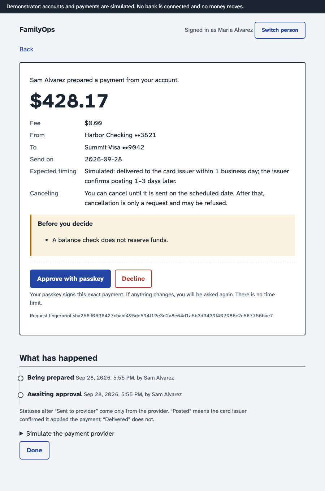

# FamilyOps

Help someone with their finances using your own identity, and nothing more than they chose to share.
An **owner** grants a named **delegate** specific, revocable abilities over specific accounts. The delegate
can see what was shared, track bills, and prepare payments. The owner approves every payment with a passkey
bound to that exact payment.

> **This is R0, the demonstrator.** Accounts, balances and payments are simulated fixtures. No bank is
> connected and no money moves. The product plan is in [docs/PRD.md](docs/PRD.md).

Parents and adult children are the motivating case, but nothing in the design depends on it. The fixtures
include a parent and adult child, two spouses who delegate to each other, and a small-business owner with a
bookkeeper.



## Walkthrough

These screenshots were produced by `src/scripts/walkthrough.ts`, which drives the running app in Chromium.
Each person gets a virtual passkey.

| Step                                                            | What to notice                                                                                                                             |
| --------------------------------------------------------------- | ------------------------------------------------------------------------------------------------------------------------------------------ |
| [Owner's home](docs/screenshots/01-owner-home.png)              | Newly connected accounts stay private until chosen. The joint account says why it can't be shared.                                         |
| [Sharing preview](docs/screenshots/03-share-preview.png)        | The grant is written out as sentences before the owner signs it.                                                                           |
| [Delegate's queue](docs/screenshots/04-helper-queue.png)        | Grouped by owner. Every bill shows its source and freshness. A guessed bill is labelled as a guess, and an unknown amount stays "unknown". |
| [Unsupported action](docs/screenshots/06-honest-capability.png) | A transfer between the owner's own accounts is refused, with the reason given.                                                             |
| [Approval slip](docs/screenshots/08-approval-slip.png)          | Amount, fee, source, destination, preparer, timing and cancellation terms on one screen.                                                   |
| [Timeline](docs/screenshots/10-timeline-posted.png)             | Every status after "Sent" comes from the provider. "Delivered" and "Posted" are different events.                                          |
| [After revocation](docs/screenshots/11-helper-after-revoke.png) | The delegate loses access on their next request.                                                                                           |

## How it works

### A kernel and a domain module

`src/kernel` knows nothing about money. It owns:

- people, sessions and passkeys
- typed **resources**
- **grants**: a set of scopes over a set of resources, plus limits the module validates
- **work items**: things someone has to handle
- **intents**: a proposed action, held as immutable revisions
- digest-bound approval, the dispatch gate, the job outbox, the webhook inbox, reconciliation, and a hash-chained audit log

A **module** registers its resource types, scopes, work-item types and intent types. `src/modules/finance` is
the only module so far. It registers:

- accounts and payees as resources
- four scopes, each described in plain language
- obligations as work items
- `finance.payment` as the one intent type

The vocabulary comes from UMA 2.0 (resource owner, requesting party, resource, scope) and from RFC 9396, which
uses a `type`-tagged details object to describe the exact thing being approved. An ESLint rule stops the
kernel from importing a module.

### The one authorisation rule

An actor may use a scope on a resource if either:

- they own it, or
- the owner selected the resource for use in the app, it is shareable, and a live grant from the owner to the actor names both that scope and that resource.

Nothing else grants access: not family grouping, not invitations, not paying for the subscription. A guessed
ID returns the same 404 as an ID that doesn't exist. Lists, totals and the work queue are all built from the
same set of visible resources.

This is hand-written SQL, not a policy engine (Cedar was considered). The rules that matter depend on stored
state: grant versions, spending reservations, and locks against revocation. A stateless engine can't enforce
those, so it would be a second system without removing any code.

### Approval is bound to the exact request

Each revision of an intent has a SHA-256 digest of its canonical JSON (RFC 8785, via `canonicalize`). The
owner's passkey signs a single-use challenge that the server bound to that digest. Changing the payee, source,
amount, fee or date creates a new revision, and the old approval no longer applies. Nothing a client sends can
mark a payment approved or executed.

### The dispatch gate

Just before anything is sent, one transaction re-checks everything:

- the approval, and whether it has expired
- the delegate's grant, including scope, resources, pause and expiry
- whether the payment route is supported
- the freeze and kill-switch controls
- the spending limits, which it reserves

In the same transaction it records the attempt and moves the payment to `Dispatching`.

The gate locks the grant row and then the payment row, the same order revocation uses. So the two serialise:

- if revocation commits first, nothing is sent;
- if the gate commits first, the owner's timeline says the payment was already in flight and a cancellation request is queued.

Every submission of a payment reuses the same idempotency key.

### Failure semantics

A timeout is never treated as a failure. The payment goes to `Reconciling`, and the worker asks the provider
whether it has an operation under that key. It resubmits only if the provider guarantees one operation per key
(the simulated one does). Otherwise the payment stays visible and waits for a person.

Webhooks are checked for a valid signature and deduplicated in an inbox. When one arrives out of order, the
provider's current state is fetched and used instead. A bill counts as verified only when the card issuer
confirms it posted. If the payment is later returned, the bill reopens and the monthly limit is given back.

## Try it

Requires Node ≥ 22.18 and any Postgres 17.

```sh
npm ci
make db-up                                   # Postgres in Docker on :54329, or skip this and…
export DATABASE_URL=postgres://…/familyops   # …point at any Postgres 17 you have
make demo                                    # wipes that database, seeds it, runs everything
```

Open http://localhost:5173. Approving a payment needs a passkey; Touch ID or Windows Hello works on `localhost`. Use
**Switch person** to move between people. Things to try, and what should happen:

1. **As Maria:** set up a passkey. Choose her checking, savings and Visa, then **Share with someone**, picking Sam, "Prepare payments" and a $1,000 per-payment limit.
   _Expected:_ the preview lists exactly what Sam will be able to do, and the joint account can't be picked.
2. **As Sam:** under "Helping Maria", prepare a payment for the Summit Visa statement. Then change "Pay to" to Maria's savings.
   _Expected:_ the Visa is sendable; the savings transfer is refused with its reason.
3. **As Maria:** open the waiting payment and **Approve with passkey**. Under "Simulate the payment provider", report _delivered_, then _posted_.
   _Expected:_ the timeline shows each step, and the bill becomes "Paid: confirmed by the card issuer".
4. **Break it on purpose.**
   - Before approving another payment, choose **Lose the next response**. _Expected:_ "Checking with provider", then "Sent", and still only one payment.
   - Edit a payment after approving it. _Expected:_ it asks for approval again.
5. **As Maria:** revoke Sam. **As Sam:** reload. _Expected:_ everything of Maria's is gone.
6. **As Tom (Maria's husband):** _Expected:_ nothing of hers is visible.
   **As Riley (support):** pause submissions. _Expected:_ Riley can't approve anything, and paused payments show "Held".

If something differs from what's described here, that's a bug. Please report it.

## Tests

```sh
make ci               # typecheck, eslint, prettier, tests, web build
make ci-docker        # the same inside node:24 with a Postgres container
```

The tests need a real Postgres. They use `TEST_PG_URL` (an admin URL) if it's set, and otherwise start a
testcontainer. Every test file clones a migrated template database.

| File                                  | What it establishes                                                                                                                                                                                                                                                                               |
| ------------------------------------- | ------------------------------------------------------------------------------------------------------------------------------------------------------------------------------------------------------------------------------------------------------------------------------------------------- |
| `test/access-property.test.ts`        | For random sequences of grant, pause, resume, revoke and deselect, SQL authorisation agrees with an independent in-memory model on every (person, scope, resource) triple, in both the point checks and the lists.                                                                                |
| `test/grants.test.ts`                 | Scoped reads and totals. Guessed IDs. Joint and unselected accounts can't be shared. A delegate can't widen their own access. The passkey is bound to the exact grant and works once. Access requests. Expiry. The audit log is append-only, and editing or deleting an exported row is detected. |
| `test/scenarios/payment-flow.test.ts` | The full path. Repeated clicks. Honest capabilities. Approval invalidated by a change. Only the owner approves, and only with a passkey. Expired approvals. Scheduled dates.                                                                                                                      |
| `test/scenarios/failures.test.ts`     | Duplicate jobs. Timeout after acceptance. Request lost before acceptance. A provider without safe retry. A worker that crashed after the gate. Declines. Webhook signatures, duplicates, reordering and early arrival. Returns. Cancelling in flight.                                             |
| `test/scenarios/races.test.ts`        | Revocation racing dispatch, run 40 times; both orderings must occur or the test fails. Concurrent spending against a monthly limit. The per-payment limit.                                                                                                                                        |
| `test/scenarios/controls.test.ts`     | Pause and resume. The support kill switch. Recovery. Self-freeze. The gate re-checks narrowed and expired grants. Unknown amounts stay unknown. Autopay and recent-payment warnings. Stale connections. Reconnect remapping. Isolation between owners.                                            |
| `test/api.test.ts`                    | Sessions are required. An actor claimed by the client is ignored. 404 parity. The idempotency header. The 422 capability response. Approving without a passkey fails. Webhook signatures. The scope of audit exports.                                                                             |
| `test/worker.test.ts`                 | The same behaviour driven by the real graphile-worker runner.                                                                                                                                                                                                                                     |

**Checking that the tests can fail.** Each guard was switched off in turn and its test re-run:

- the step-up digest binding
- the approval digest check
- the stable idempotency key
- "a timeout is not a failure"
- the monthly-limit lock
- owner-only approval
- the gate's scope and expiry checks
- revocation's immediate cancellation

Each made its test fail.

Three guards are deliberate second layers, and no test fails when one is removed on its own:

- Revocation's immediate cancellation and the gate's "grant still exists" check each stop a revoked delegate's payment; the race test fails only when both are removed.
- The `selected` filter backs up the removal of deselected accounts from grants.

## Deliberately not here

- Plaid, Method, Dwolla or any bank. The provider questions in PRD §12 have to be answered before R1 and R2.
- Real identity (OIDC), notifications and incapacity flows. R0 uses a fixture login and real passkeys.
- AI features and pricing.

## Known limits of R0

- **Time zones.** The scheduled date is a calendar date, and the server accepts "yesterday in UTC" so that "today" works anywhere in the Americas. Owners' time zones are not modelled.
- **One executor per intent type.** R2 will need capability routing across providers.
- **Recovery.** The "independent verification" step is simulated.
- **Webhook handling.** A webhook that conflicts with our state triggers a provider fetch inside a database transaction. That's fine for a simulator, but it should move out of the transaction before a real provider is used.
