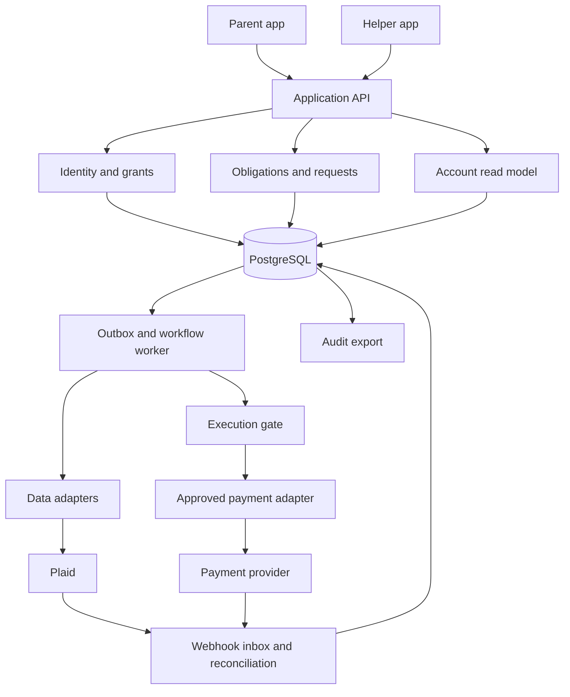
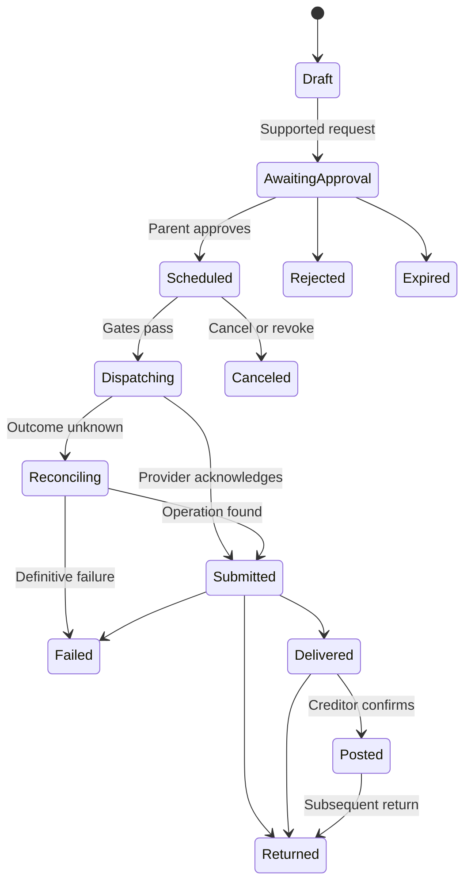

# FamilyOps: delegated financial administration

PRD and architecture proposal · v0.1 · September 28, 2026

> Note (2026-09-28): parents and adult children are the motivating example, not the boundary. The implementation treats delegation generically — any owner, any delegate — through a domain-neutral kernel with finance as the first module. See the README's architecture section.

## 1. Recommendation

Build a family financial administration application for U.S. accounts. An adult child can see specifically shared accounts, organize obligations, prepare actions, and track their resolution. Each parent controls access and approves payments. Add execution for a narrow set of supported payments after a provider accepts the actual funding and delegation model.

The core promise is: **“Help manage your parents’ finances using your own identity. They decide what you can see and do.”**

Start independently with account visibility and shared workflows. In parallel, validate one payment route and explore one bank partnership. Do not make a national bank integration a prerequisite for learning whether families want the product. Do not make unsupported payment APIs a dependency of the first release.

The product is successful when it reduces the work and uncertainty of financial administration while preserving the parent’s control. A dashboard alone is insufficient; the application needs a shared queue of work, explicit responsibility, approval, and evidence of completion.

This document proposes product and engineering decisions. Vendor capabilities are distinguished from assumptions below. It does not establish provider approval or settle legal authority questions.

## 2. Corrections to the preceding discussion

| Earlier assumption | Verified boundary | Design consequence |
| --- | --- | --- |
| Plaid Transfer can move money between Mom’s checking and savings | Plaid explicitly excludes peer-to-peer transfers and transfers between accounts held by the same person. Its Auth product can support a separate processor integration. [1, 2] | Do not implement that example with Plaid Transfer. Select an approved processor for the exact use case. |
| Plaid plus Method is a complete end-to-end payment stack | Method’s current payment guide describes corporate funding and configured FBO or per-payment funding. It does not, by itself, establish the proposed consumer checking debit flow. [3, 4] | Require a documented funding path, return handling, and accepted family-delegation model before choosing Method for execution. |
| Banno Households establishes a general caregiver API | Its documentation concerns credit union households and joint users, includes institution-specific configuration, and cautions about manually created users and account-access persistence. [5] | Treat it as a potential partner capability, not proof of universal non-owner delegation. |
| Aggregated account data is live | Plaid documents transaction checks typically one to four times daily and liabilities updates approximately daily. [6, 7] | Show source and freshness. Never imply that a transaction feed reserves funds or guarantees payment success. |
| Parent approval lets the app change any bank or biller setting | Approval provides permission; execution still requires a supported integration. | No generic “change Comcast autopay” or “manage Chase card” button without a verified adapter. |

There is no meaningful evidence for the earlier “60–70% complete with Plaid” estimate. Feasibility should be measured against specific tasks and supported account pairs.

## 3. Users and first use case

**Initial customer:** an adult child helping one or two parents who can consent and approve actions, with accounts at multiple U.S. institutions. The child may purchase the subscription; paying does not confer access to the parents’ information.

**Parent:** owns or controls the relevant accounts, chooses what to share, approves payments, and can pause access independently.

**Helper:** monitors shared information, resolves questions, prepares payment requests, and follows up on exceptions. One helper can support multiple people; each relationship has separate grants.

**Initial job:** “Help me make sure my parents’ recurring obligations are handled, without repeatedly asking them for credentials or wondering whether a payment went through.”

Pilot with 10–15 families. Interview parent and helper separately as well as together. Include people whose finances already run mostly on autopay: the product must establish whether exception handling and coordination save enough effort to justify another app.

## 4. Scope and release sequence

| Capability | R0: demonstrator | R1: connected pilot | R2: payment pilot | Later |
| --- | --- | --- | --- | --- |
| Separate parent/helper identities | Yes | Yes | Yes | Yes |
| Account-specific sharing and revocation | Simulated accounts | Live data | Live data | Broader policies |
| Balances, transactions, selected liabilities | Fixtures | Supported Plaid products | Same | Additional adapters |
| Shared obligation list and evidence | Yes | Yes | Yes | More bill sources |
| Prepare and approve an action | Simulated execution | Track request; handoff where necessary | Execute supported creditor payments | Bounded delegated execution |
| Pay credit-card bills | Clearly simulated | External handoff | Conditional on provider acceptance and coverage | Broader creditor coverage |
| Transfer between parent’s own accounts | Simulation only | External task | Excluded initially | Approved processor/bank integration |
| Generic utilities, tax, insurance payments | Manual tasks | Manual tasks | Only if specifically supported | Dedicated biller adapters |
| Bank-native card, profile, CD, or dispute operations | No | No | No | Bank partnership |

R0 must never be presented as a live banking integration. R1 is useful independently but must be described as coordination and monitoring. R2 is the first release that promises in-app payment execution.

Initial exclusions: cash custody by FamilyOps, general person-to-person transfers, investment trading, beneficiary changes, account opening/closure, helper access to bank credentials, and autonomous AI execution. Handling incapacity or an inability to consent requires a separately designed authority and support flow; ordinary app recovery must not silently become that flow.

## 5. Product experience

### A. Establish the relationship

The helper can send an invitation. The parent independently creates an account, authenticates, connects supported institutions, selects accounts, and grants access. An invitation alone exposes no financial information. The parent sees who will receive access and a plain-language preview of what they will see.

The pilot supports bank-hosted OAuth connections where available and selects its initial institutions accordingly. Other connection methods require explicit evaluation and disclosure; the application never promises that every Plaid connection has identical credential handling. Reconnection remains an owner action.

Each parent has a separate resource boundary. A family grouping is navigation and coordination, not an entitlement. Mom sharing with Gaurav does not share with Dad, siblings, or a household administrator. Newly discovered accounts are private until explicitly selected. Joint accounts require a documented ownership and sharing policy before inclusion; do not infer sole authority from successful linking.

### B. Review what needs attention

The helper opens a list organized by parent: upcoming obligations, payment exceptions, stale connections, and questions. Every item has an owner, amount if known, due date if known, source, freshness, status, and next action.

Distinguish three evidence levels: provider-reported bill data, a user-confirmed bill or statement, and an inferred recurring transaction. A recurring charge is a suggestion to review, not proof that a bill is due. Missing values say “unknown”; they never become zero.

### C. Prepare a payment

For an eligible account pair, the helper selects the creditor, funding account, exact dollar amount, and date. The app checks execution support before showing an approval action. A request might read: “Gaurav prepared a $428 payment from checking ending 3821 to your Visa ending 9042. Review amount and timing.”

The parent sees the amount, fee, source, destination, requestor, expected timing, and cancellation limits in one screen. Approval requires authenticated confirmation bound to that exact request. Email or SMS opens the authenticated screen; clicking a notification is not approval.

For unsupported actions, offer a task with instructions and an appropriate institution link. Do not claim the bank form is prefilled or the payment can execute from FamilyOps. Track “marked done by Mom” separately from verified completion.

### D. Follow the outcome

Show “awaiting approval,” “scheduled,” “submitted,” “delivered,” and “posted” only when supported by evidence. A successful API response does not mean a creditor has applied the money. Method, for example, distinguishes delivery from creditor posting and has reversal states. [8]

Flag existing autopay and a potentially matching payment before another payment is approved. The app cannot prevent payments made outside its system; when evidence is stale or ambiguous, ask the user to review rather than promising duplicate protection across all institutions.

### E. Revoke access

The parent can pause a helper or revoke a grant without the helper’s involvement. New reads and undispatched actions are denied after the revocation transaction commits. Explain any payment already dispatching or submitted, whether cancellation is possible, and its eventual outcome. Revocation does not retract previously downloaded information or automatically recall money.

## 6. Requirements and acceptance criteria

| ID | Requirement | Acceptance criterion |
| --- | --- | --- |
| P1 | Separate identities | Every read, mutation, approval, and dispatch records its actor; no shared app account is required. |
| P2 | Explicit grants | Grant binds owner, helper, resources, operations, expiry, and version; new resources receive no inherited permission. |
| P3 | Scoped data access | Lists, searches, exports, notifications, and aggregate totals exclude unshared resources; guessed IDs cannot bypass checks. |
| P4 | Honest capabilities | Each action is executable, requires setup, requires external completion, or unavailable, with a reason. |
| P5 | Evidence and freshness | Every financial observation and obligation records source and observed time; inferred items are visibly labeled. |
| P6 | Exact approvals | Changes to payee, source, amount, fee, currency, or schedule invalidate approval and require a new revision. |
| P7 | Safe dispatch | Current grant, approval, provider capability, and execution authorization are rechecked immediately before dispatch. |
| P8 | Duplicate prevention | One payment intent produces at most one provider operation under repeated clicks, worker restarts, or network retries. |
| P9 | Payment reconciliation | Every submission is reconciled with authoritative provider state; unknown outcomes remain visible and block blind resubmission. |
| P10 | Independent control | Parent can revoke, reject, and recover access without the helper; helpers cannot expand their own grants. |
| P11 | Accessible approvals | Large text, keyboard and screen-reader support, plain language, and no timer pressuring a parent to approve. |
| P12 | Auditable support | Support can inspect necessary metadata but cannot impersonate the parent or create a valid approval. |

## 7. Permission model

Keep three independent authorization records:

1. **Data connection consent:** the parent permits a provider/application to retrieve selected information.
2. **Application delegation:** the parent grants a named helper specified rights over selected resources.
3. **Payment authorization:** the execution provider accepts the specific payment or standing instruction under the approved program.

None implies either of the others. A provider’s risk decision is also not a substitute for the parent’s approval.

R1/R2 helper permissions are `balances.read`, `transactions.read`, `obligations.manage`, and `payments.prepare`, scoped to accounts and obligations. A parent retains grant management and payment approval. Reading balances need not imply reading the transaction history.

Later, a parent may grant `payments.execute` with an allowlist of verified payees, per-payment and cumulative caps, an expiry, and rules requiring approval. Category labels such as “utilities” are insufficient: use verified payee identities. A helper cannot relabel a recipient to obtain authority. Requests for expanded authority must show the old and proposed permissions to the parent.

Illustrative future policy, not a pilot default:

```json
{
  "owner_id": "person_mom",
  "delegate_id": "person_gaurav",
  "resource_ids": ["account_checking_1"],
  "actions": ["balances.read", "payments.prepare", "payments.execute"],
  "execution": {
    "allowed_payee_ids": ["payee_verified_visa"],
    "currency": "USD",
    "per_payment_cap_cents": 50000,
    "monthly_cap_cents": 150000,
    "period_timezone": "America/Los_Angeles",
    "new_payee": "owner_approval"
  },
  "expires_at": "2027-03-01T00:00:00Z",
  "version": 3
}
```

Reserve cumulative limits atomically across concurrent requests and relevant grant/owner scopes. Pending submissions count against limits. Release reservations only after a definitive outcome according to policy; an ambiguous timeout cannot restore spending capacity.

## 8. Architecture

Use a modular monolith with a separate background worker and payment credentials restricted to the worker. Avoid starting with distributed microservices. The domain model and adapter boundaries matter more than the number of deployments.



**Suggested stack:** TypeScript, React responsive web application, a Node API and worker, PostgreSQL, managed OIDC/passkey authentication, managed job delivery, KMS-backed secrets, and encrypted object storage. Select supported framework versions at implementation time. Treat this as a deployment shape, not a claim that a particular library provides financial authorization out of the box.

| Module | Responsibility | Boundary |
| --- | --- | --- |
| Identity and grants | Sessions, grants, revocation, policy evaluation | Never treats membership as account access |
| Connections and read model | Provider tokens, ingestion, account mapping, freshness | Has no payment submission capability |
| Obligations | Bills, inferred recurrence, tasks, evidence, assignments | Does not turn inference into authority |
| Intent and approvals | Immutable request revisions and approval evidence | Cannot approve on a parent’s behalf |
| Execution worker | Rechecks, reservations, provider submission | Only component with payment credentials |
| Reconciliation | Webhooks, polling, status mapping, exceptions | Does not infer failure from timeout |
| Audit and support | Actor history, restricted support views, exports | Cannot silently rewrite financial history |

Plaid connection tokens remain encrypted on the server. Do not create a broad “family token.” Each request derives the authenticated actor from the session and resolves authorization over server-side resources. Database row-level security can provide defense in depth, but action-level policy remains explicit.

## 9. Data model and application APIs

| Object | Essential fields |
| --- | --- |
| Person / AuthIdentity | Stable person ID, identity-provider reference, authentication methods |
| CoordinationGroup / Membership | Grouping and invitation state; explicitly carries no account authority |
| Connection / ConnectionConsent | Consenting person, provider, encrypted token reference, products, consent and reconnect state |
| FinancialAccount / AccountParty | Stable internal account ID, provider mappings, ownership evidence and relationship, currency |
| Observation / Transaction | Account, source, observation time, provider reference, revisions, pending/posted state |
| DelegationGrant | Grantor, delegate, resource/action set, policy, expiry, revocation, version |
| Capability | Account pair/action, adapter, support state, prerequisites, freshness, reason |
| Obligation / Evidence | Account owner, creditor, amount/date, source, confidence, existing-autopay state |
| PaymentIntent / IntentRevision | Owner, initiating actor, exact source/destination/amount/fee/date, revision digest |
| Approval / ExecutionAuthorization | Approver, revision digest, authentication evidence, expiry; separate provider authorization record |
| PaymentAttempt / PaymentLeg | Intent, provider operation IDs, stable idempotency key, raw and normalized state |
| LimitReservation / JournalEntry | Amount reserved; balanced operational entries if funds have multiple legs |
| InboxEvent / OutboxJob / AuditEvent | Deduplication, durable work, correlation and actor history |

Use integer minor units for USD amounts. Preserve provider IDs and raw status alongside normalized state. Internal account IDs must survive reconnection where identity can be established; ambiguous mappings require review. Never merge accounts based only on the last four digits or count a joint account twice in household totals.

Proposed internal API, not vendor endpoint names:

```text
POST   /connection-sessions
POST   /delegation-grants
DELETE /delegation-grants/{id}
GET    /accounts
GET    /accounts/{id}/capabilities
POST   /obligations
POST   /payment-intents
POST   /payment-intents/{id}/approval-requests
POST   /payment-intents/{id}/approvals
POST   /payment-intents/{id}/cancel-requests
GET    /payment-intents/{id}/timeline
POST   /webhooks/{provider}
```

Mutation APIs require idempotency and revision checks. Clients cannot supply a trusted actor, approval result, or provider-execution status. Approval is bound to a canonical digest of the full intent, not merely a mutable payment ID.

## 10. Payment execution and failure semantics

Submission must follow this order: validate the current intent and evidence; confirm account-pair capability and authorization; obtain exact parent approval; revalidate at dispatch; reserve applicable limits and enqueue durable work atomically; submit through the approved adapter; reconcile until the outcome is known.

The dispatch gate serializes against revocation using a grant version and database lock. If revocation wins, no submission occurs. If dispatch wins, mark the payment as dispatching before contacting the provider; revocation then attempts cancellation where possible and tells the parent that this action may already be in flight. Do not claim an atomic transaction spanning the database and an external payment API.



This is a conceptual model. Adapters preserve more detailed provider states and support skipped stages; no universal posting confirmation is assumed. A draft can also become an external task instead of entering the execution path.

Use a transactional outbox and a durable webhook inbox. Verify webhook authenticity using each provider’s documented mechanism, deduplicate, tolerate delayed or out-of-order events, and fetch authoritative state when events conflict. Retry a submission with the same idempotency key only under that provider’s documented semantics. If safe recovery is unavailable, stop for reconciliation rather than inventing a new operation.

For any future two-leg funding flow, reconcile collection, availability, payout, fees, and returns independently with a balanced operational journal. Never route customer funds through FamilyOps’ ordinary operating account as an informal bridge. A balance check does not reserve bank funds, and a settled collection can still carry return exposure. Provider acceptance must specify who bears that exposure and when payout is permitted.

## 11. Security, privacy, and operations

Use passkeys where possible and step-up authentication for grants, approvals, and recovery. Offer accessible independent recovery for the parent; the helper cannot reset the parent’s credentials or become the sole recovery contact. Recovery temporarily pauses execution until independent verification completes.

Enforce authorization consistently on notifications, exports, summaries, caches, and support views. A revoked helper must lose server access immediately after commit, including through stale sessions. Previously delivered content cannot be erased remotely. Redact bank tokens, account numbers, and sensitive identity information from logs and analytics.

Record actor, owner, grant version, intent revision, approval evidence, policy outcome, and provider reference in audit events. Export append-only events to storage with tamper-resistant retention; an ordinary mutable database table alone is not an immutable audit trail. Define retention and deletion separately for financial evidence, raw provider data, attachments, and optional analytics.

Operations need payment exception queues, provider-outage controls, account reconnection handling, and a kill switch for new submissions. Support may freeze activity and investigate; resuming or approving money movement requires the defined controls. An observed unusual transaction should be described as a review prompt, not a fraud finding.

AI is optional. Later it can extract bill fields, summarize changes, and suggest tasks with source references. It cannot create grants, certify payees, approve payments, or bypass deterministic policy. Uploaded statements are untrusted inputs. The MVP works without an LLM.

## 12. Provider validation and partnership plan

| Workstream | Candidate and evidence | Required answer before commitment |
| --- | --- | --- |
| Aggregation | Plaid Transactions/Liabilities; Auth where needed [2, 6, 7] | Exact institution/product coverage, family data-sharing acceptance, owner consent, OAuth availability, refresh and pricing |
| Creditor payment | Method is a candidate for creditor delivery, not a confirmed complete funding solution [3, 4] | Can this program collect from an individual parent and pay that parent’s creditor? Which funding path, entities, reserves, permissions, returns, and actor records are required? |
| Account transfers | Evaluate an approved processor separately; Dwolla documents a flow between an end user’s own linked accounts [9] | Is delegated family initiation accepted? What customer model and funds path apply? Does one operation cover both legs? |
| Native banking | A bank/credit union and its digital platform; Banno is one lead [5] | Non-owner delegate support, API exposure, grant/revocation semantics, action coverage, and durable actor attribution |

Ask vendors to review the same concrete scenario: “Mom links her checking account, authorizes Gaurav to prepare a $428 payment to her existing card, independently approves that request, and expects a traceable outcome.” Then ask whether standing, bounded authority changes the answer. Sandbox success is not production acceptance.

For a bank partnership, request a small interface: discover capabilities, register a delegate, grant/revoke rights, submit an actor-attributed intent, and obtain status. Preserve both the account owner and actual actor end to end. OAuth scopes or actor claims alone do not guarantee the bank enforces the requested policies.

## 13. Delivery plan and tests

Illustrative estimate for two experienced engineers plus part-time design and payment/security expertise; not a commitment. Vendor onboarding and bank procurement have separate, uncertain timelines.

| Stage | Indicative effort | Exit condition |
| --- | --- | --- |
| Discovery and provider diligence | 1–2 weeks | Interviews, representative account/task inventory, and a written provider feasibility response |
| R0 demonstrator | 2 weeks | Parent/helper onboarding, permissions, approval, revocation, and failure cases work with fixtures |
| R1 connected pilot | 4–6 further weeks | Supported live data, freshness, shared obligations, external-task tracking, and grant isolation |
| R2 payment pilot | 4–8 further weeks after provider acceptance | One narrowly supported payment route, operational support, reconciliation, and security review |
| Bounded execution / bank features | Re-estimate after pilot | Evidence that repeated owner approvals or bank handoffs are the dominant remaining friction |

Payment release tests must include cross-family access attempts, hidden data leaking through aggregates, helper self-escalation, source/payee changes after approval, expired approvals, concurrent limit spending, revocation racing dispatch, duplicate jobs, provider timeouts after acceptance, reordered webhooks, returned payments, stale bills, existing autopay, reconnection remapping, and parent account recovery. Fault-inject these scenarios; line coverage is not an adequate release criterion.

Proposed operational targets: cached authorized views p95 under two seconds; access revocation enforced on the next server request after commit; every dispatched intent recoverable and auditable; accepted provider events reflected within five minutes under normal operation. These are application targets, not promises of bank data freshness or creditor posting speed. A confirmed unauthorized or duplicate execution pauses new payments while investigated.

## 14. Validation, economics, and decision gates

The primary product measure is **verified obligations resolved with less combined parent/helper effort**, measured against each family’s baseline. Track parent effort separately so that saving the helper time does not simply transfer work to the parent. Do not count simulated or self-reported payment completion as verified settlement.

Pilot hypotheses, not established benchmarks: at least 70% of enrolled pairs complete linking and sharing without founder intervention; median measured administrative effort falls by at least 30%; at least 60% of activated families return in the second month; most parents can correctly explain and revoke their helper’s permissions in a usability test. Track the supported share of requested tasks across all accounts, not just the supported subset.

Guardrails include unexplained payment states, reconnection frequency, false alerts, support minutes per family, late-payment incidents, duplicate payments, unauthorized access, and parent understanding. A small pilot cannot establish a precise rare-event safety rate.

Test a family subscription, paid by the helper without expanded authority. Do not set pricing from unverified API prices. Monthly contribution equals subscription revenue minus connected-account/data fees, payment fees, identity/authentication costs, messaging, support, and expected losses. Obtain quotes and measure support effort before committing to pricing. Bank distribution is an alternative business model if consumer acquisition or direct payment economics are weak.

Continue toward R2 if families use the coordination workflow and an execution provider accepts the exact program. Pursue a bank-led product sooner if the most valuable tasks require native account controls or providers reject the independent model. Reconsider a standalone subscription if connected visibility and workflows do not reduce work enough to earn repeat use.

Publish an essay alongside the demonstrator once these boundaries are understood. The defensible claim is that families need separate identities and explicit permissions across institutions, while existing support is uneven. Do not claim that human delegation is absent from banking or that a data API alone solves it.

## 15. Open decisions

Before R1: initial institution coverage; acceptable connection methods; supported account ownership structures; parent recovery process; exact data retention; provider permission for onward sharing to named helpers.

Before R2: executing provider and funding architecture; supported creditors; proof of authorization; liability and return allocation; cutoff and cancellation behavior; posting evidence; operational coverage; provider fees and minimum commitments.

After R2: whether users value standing delegated payments, wider bill coverage, same-owner transfers, or bank-native administration most. Let observed unfinished tasks determine the next integration.

## Sources

Official documentation reviewed September 28, 2026. Capabilities may change; product proposals and effort estimates above are our design judgments.

1. [Plaid: Creating transfers](https://plaid.com/docs/transfer/creating-transfers/) — peer-to-peer and same-person transfer exclusions.
2. [Plaid: Auth](https://plaid.com/docs/auth/) — account authentication and payment processor integrations.
3. [Method: Payments overview](https://docs.methodfi.com/guides/payments/overview) — configured funding and creditor payment requirements.
4. [Method: Transactions & Bill Pay](https://docs.methodfi.com/guides/use-cases/pfm/transactions-payments) — current PFM guide’s corporate funding example.
5. [Jack Henry: Households](https://knowledge.banno.com/digital-banking/earn-spend-save/authentication/households/) — household identities, permissions, prerequisites, and manual-user caveat.
6. [Plaid: Transactions](https://plaid.com/docs/transactions/) — data ingestion and update frequency.
7. [Plaid: Liabilities](https://plaid.com/docs/api/products/liabilities/) — supported liability types, fields, and approximate refresh cadence.
8. [Method: Payment lifecycle](https://docs.methodfi.com/guides/payments/lifecycle) — delivered versus posted, failures, and reversals.
9. [Dwolla: Client integration guide](https://www.dwolla.com/p/customer-integration-guide/) — documented own-account flow; does not establish acceptance of this family delegation program.
